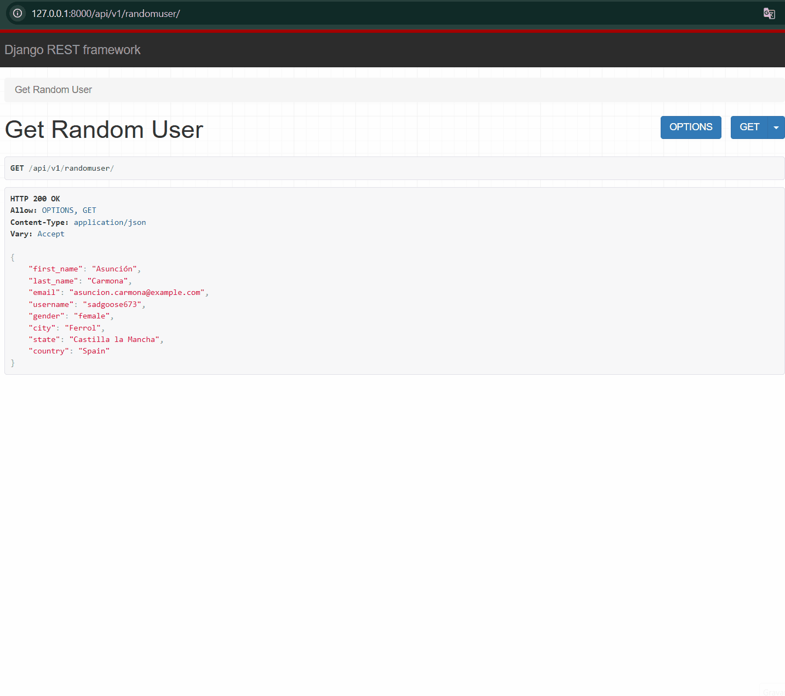
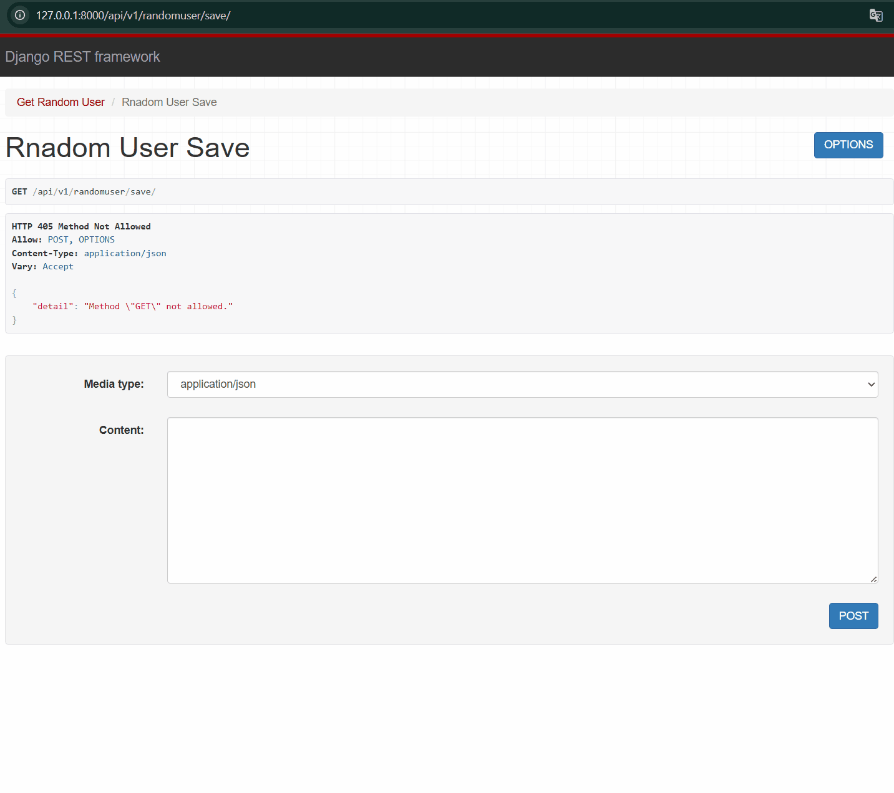
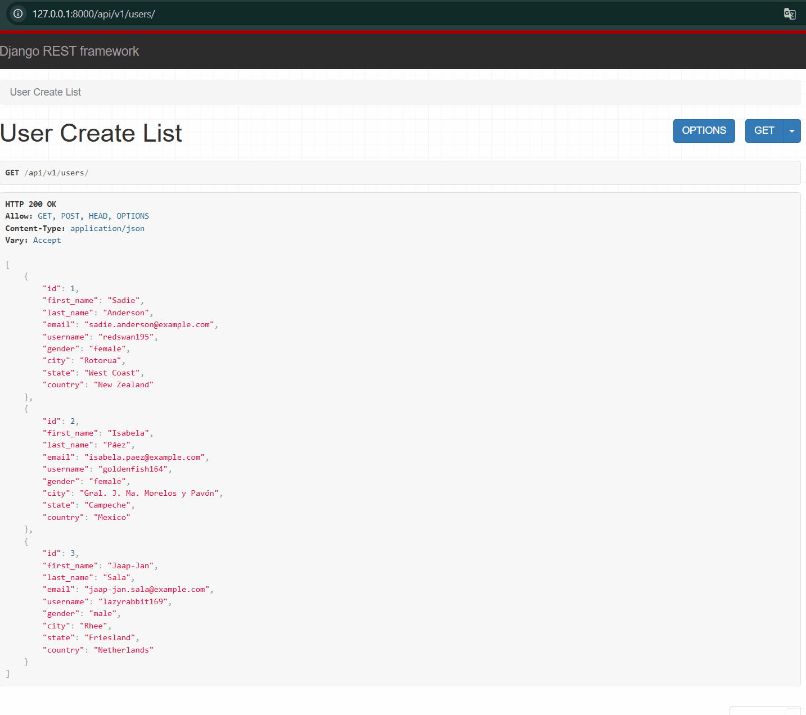
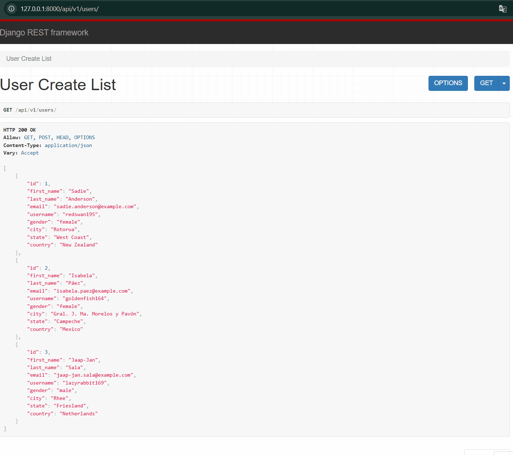

# Integração Django REST Framework com RandomUser API e PostgreSQL

Este projeto implementa uma **API REST** utilizando **Django REST Framework** integrada ao banco de dados **PostgreSQL**.  
Ele consome dados da [RandomUser API](https://randomuser.me/) e permite salvar, consultar, atualizar e excluir usuários no banco local.  

---

## 🚀 Funcionalidades

- **GET /api/v1/randomuser/**  
  Consulta um usuário aleatório da API RandomUser (não salva no banco).

- **POST /api/v1/randomuser/save/**  
  Consulta um usuário aleatório da RandomUser API e **salva no banco**.

- **GET /api/v1/users/**  
  Lista todos os usuários cadastrados no banco.

- **GET /api/v1/users/{id}/**  
  Retorna um usuário específico pelo ID.

- **PUT /api/v1/users/{id}/**  
  Atualiza os dados de um usuário.

- **DELETE /api/v1/users/{id}/**  
  Exclui um usuário.

---

## 🛠 Tecnologias Utilizadas

- [Python 3.13+](https://www.python.org/)
- [Django 5](https://www.djangoproject.com/)
- [Django REST Framework](https://www.django-rest-framework.org/)
- [PostgreSQL](https://www.postgresql.org/)
- [Requests](https://docs.python-requests.org/)
- [Flake8](https://flake8.pycqa.org/) (linting e boas práticas)

---

## 📂 Estrutura do Projeto

integrarandomuserdjango/

│── users/ # App principal (models, views, serializers, urls)

│ ├── migrations/ # Arquivos de migração do banco

│ ├── models.py # Modelo User

│ ├── serializers.py # Serializador DRF

│ ├── views.py # Lógica da API

│ └── urls.py # Rotas do app

├── app/ # Configurações principais do Django

├── manage.py

└── requirements.txt

## ⚙️ Configuração do Ambiente

### 1. Clonar o repositório

```bash
git clone https://github.com/diego69775/IntegraRandomUserDjango.git
cd IntegraRandomUserDjango
```

2. Criar e ativar ambiente virtual
```bash
python -m venv venv
source venv/bin/activate   # Linux/Mac
venv\Scripts\activate      # Windows
```

3. Instalar dependências
```bash
pip install -r requirements.txt
```

4. Configurar banco PostgreSQL
Crie um banco no PostgreSQL:
```sql
CREATE DATABASE randomuserdb;
```

Edite o settings.py:
```python
DATABASES = {
    'default': {
        'ENGINE': 'django.db.backends.postgresql',
        'NAME': 'randomuserdb',
        'USER': 'postgres',
        'PASSWORD': 'sua_senha',
        'HOST': 'localhost',
        'PORT': '5432',
    }
}
```

5. Rodar migrações
```basg
python manage.py makemigrations
python manage.py migrate
```

6. Rodar servidor local
```bash
python manage.py runserver
```

✅ Testando Endpoints / 📸 Demonstração em GIF

Com o servidor rodando em http://127.0.0.1:8000/:

[GET] /api/v1/randomuser/ → Consulta usuário aleatório da API externa


[POST] /api/v1/randomuser/save/ → Consulta e salva usuário no PostgreSQL


[GET] /api/v1/users/ → Lista usuários cadastrados


[GET] /api/v1/users/1/ → Usuário por ID
[PUT] /api/v1/users/1/ → Atualiza usuário
[DELETE] /api/v1/users/1/ → Remove usuário


Você pode usar Postman, Insomnia ou cURL para testar.

🔍 Qualidade do Código

Este projeto utiliza flake8 para análise de estilo e boas práticas.
Para rodar a verificação:
```bash
flake8
```
